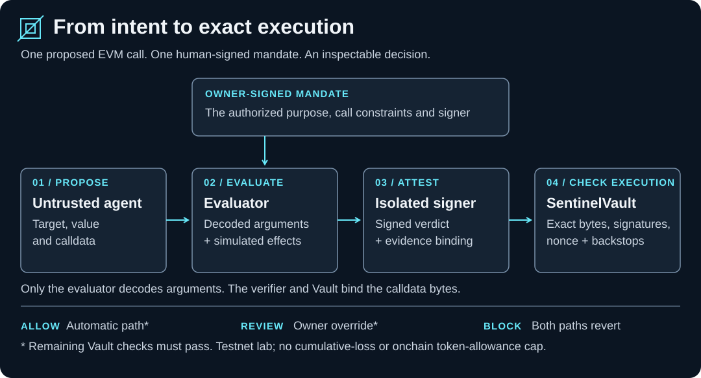

# Sentinel

**A testnet lab for checking an agent's proposed EVM call against a human-signed mandate.**

An agent can propose a transaction. What connects that proposal to what its owner actually
authorized? Sentinel makes that connection inspectable: evaluate the decoded call and its
simulated effects, sign the verdict, and bind execution to the exact attested bytes.

[Run the demo](#run-the-demo) · [How it works](#how-it-works) · [Understand the limits](#what-the-lab-does-not-establish) · [Explore the evidence](#explore-the-repository)

**Scope:** a local Anvil demonstration for technical evaluators. No production deployment or
safety for funds is claimed. The Vault has no cumulative-loss cap or onchain token-allowance
cap; only the evaluator decodes calldata arguments. Testnet-only use is documented, not
enforced. [Read the full boundaries.](release/README.md#what-this-release-does-not-bound)

<picture>
  <source media="(max-width: 960px)" srcset="assets/sentinel-flow-mobile.svg">
  
</picture>

## Why this project exists

Sentinel makes a specific agent-security question reproducible: **does one proposed call conform
to the owner's mandate, and can a different call be substituted after approval?**

The project gives you three things to examine:

- **A separation of proposal and signing authority.** The proposer is untrusted. An evaluator
  checks conformance, and a signer in a separate process issues the signed receipt.
- **A verifiable record of one decision.** EIP-712 signatures and content hashes bind the
  mandate, policy, action and evidence. A Python verifier checks the publication bundle offline
  and explicitly lists what it cannot establish.
- **Runnable failure cases.** The demo executes an authorized purchase and checks refusals for
  a redirected beneficiary, a wrong deployment authority, altered calldata and receipt replay.
  The repository also keeps the tests, adversarial findings and corrections behind its claims.

This is a conformance lab, not a general detector of malicious contracts or prompt injection.
The cold demo uses scripted proposals; it needs no LLM account, API key, funded wallet or remote
RPC service. Package installation requires internet access; the demo runs against local Anvil.

## Run the demo

You need **Node 24+**, **Foundry** (`forge` and `anvil`) and **Python 3.9+**. Python needs no
third-party packages. The recorded toolchain is Node 26.3.0 and Python 3.9.6
([version pins](.tool-versions)), with Foundry 1.7.1 used in [CI](.github/workflows/gate.yml).

```sh
git clone --recurse-submodules https://github.com/johnrfite1/sentinel.git
cd sentinel/release
npm --prefix ts ci
forge build --root contracts
npm --prefix ts run cold-demo -- --output "$PWD/demo-out"
```

Already cloned? Start at `cd release` from the repository root. The demo starts a fresh Anvil,
generates owner, signer and deployment-authority keys in memory, and shuts down its processes
when it finishes. It does not write private keys. Keep the absolute output path shown above:
`npm --prefix` runs the script from `ts/`, so a relative output path lands there.

### What you should see

The positive control prints `PASS positive: exact authenticated call executed`. Seven negative
controls print `PASS negative:` with the specific refusal they expected:

| Control | Expected result |
| --- | --- |
| Authorized purchase | The exact call executes. |
| Beneficiary changed inside the calldata | The evaluator returns BLOCK; both Vault entry points and both publication-verifier paths refuse that receipt (four controls). |
| Wrong deployment authority | The publication verifier refuses the manifest signature. |
| Calldata changed after signing | The Vault reverts with `CalldataMismatch()`. |
| Same receipt presented again | The Vault reverts with `BadNonce()`. |

A negative control passes only when it sees its expected refusal. A crash, missing file or
transport failure does not count as a successful rejection.

### Inspect and verify the output

| File or directory under `release/demo-out/` | What it contains |
| --- | --- |
| `sample/` | The ALLOW bundle: mandate, policy, exact call, evidence and signed receipt. |
| `sample-block/` | The BLOCK bundle for the redirected-beneficiary action. |
| `deployment-manifest.json` | The deployment description signed by this run's lab authority. |

Follow the [independent verification commands](release/README.md#independent-verification) to
check those files yourself. Use the authority address printed at the end of the demo and run
within **five minutes**: the ALLOW receipt expires 300 seconds after signing. Re-run the demo
for fresh material if it has expired. The BLOCK bundle is refused for its verdict on either
execution path even after that window closes.

**The demo's authority is generated by the demo itself.** Verifying against its printed address
checks self-consistency; it does not independently authenticate a deployment. A real recipient
must obtain the authority address through a channel the publisher does not control. No signed
deployment manifest is checked into this repository.

## How it works

1. **The owner signs a mandate.** It names the signer, chain, Vault, target, selector, purpose,
   beneficiary, value ceiling and validity window, and binds a policy.
2. **An untrusted proposer supplies a call.** The evaluator compares the decoded arguments and
   simulated effects at a recorded block with that mandate and policy.
3. **The isolated signer attests a verdict.** The receipt binds the evaluated action and
   evidence, including a hash of the calldata bytes.
4. **The Vault checks execution conditions.** It checks the receipt, exact calldata binding,
   validity windows, active mandate and policy, allowlists, value ceiling and nonce.

| Verdict | Automatic path: `executeWithReceipt` | Owner path: `executeWithOverride` |
| --- | --- | --- |
| **ALLOW** | Accepted if the remaining checks pass | Refused: this path requires REVIEW |
| **REVIEW** | Refused | Requires a separate valid owner-signed override for this exact receipt and action |
| **BLOCK** | Refused | Refused; an override cannot make BLOCK executable |

**Example:** the demo authorizes a purchase for the owner. A second proposal keeps the target,
selector and value, but substitutes another beneficiary inside the calldata. The evaluator
decodes that change and returns BLOCK. The signer signs the BLOCK verdict, and the Vault refuses
it. The Vault does not independently decode the beneficiary; trusting the evaluator's decoded
record remains part of the design.

### Two verifiers, different questions

| Tool | Question it answers | Where to start |
| --- | --- | --- |
| [`release/verifier/verify_publication.py`](release/verifier/verify_publication.py) | Does the bundle satisfy the Vault's **offline-checkable** execution predicate for the named entry point? | Fresh demo output. [Commands and exit codes](release/README.md#independent-verification). |
| [`verifier/verify.py`](verifier/verify.py) | Is this bundle **authentic** under the supplied trust root? This does not certify execution. | Checked-in fixtures; Python alone is sufficient. [CLI and trust-root requirements](verifier/verify.py). |

For the publication verifier, exit **0** means `PASS (static, offline)`, exit **1** means refused,
and exit **3** under `--evaluation-time` is a diagnostic that certifies nothing.

For the authenticity verifier, exit **3** means `AUTHENTIC, NOT EXECUTABLE`: for example, a BLOCK
receipt, REVIEW without an override, a signed refusal to issue a receipt, or an expired receipt.
The checked-in fixtures now fall into that category. These two tools' successful results are
different claims; neither is proof that a transaction will execute on the live chain.

## What the lab does not establish

These limits are part of the artifact being evaluated:

- **Offline verification does not read chain state.** It cannot establish live deployed code,
  nonce freshness, current pause or activation state, or actual execution at a block. Its clock
  is unauthenticated. Every certifying result includes a `NOT ESTABLISHED` explanation.
- **Only the evaluator decodes calldata arguments.** The verifier and Vault bind the bytes.
  The publication verifier also compares the signer's attested decoded record with the mandate;
  that can expose an honest misconfiguration, but cannot expose a signer lying about those bytes.
- **Native-value limits apply per action.** Valid sequential receipts can drain a funded Vault
  in a single transaction. `pause` cannot interrupt that transaction. There is no aggregate or
  rate limit, and no onchain token-allowance cap.
- **Some policy fields are only hash-bound by the offline verifier.** A signed field is not
  necessarily an enforced constraint. Manifest lifetime also does not establish revocation.

The [release's full limits](release/README.md#limits-of-that-predicate) and
[v0.3 design record](docs/enforcement-release-v0.3.md) connect these boundaries to their tests
and rulings. They are accepted lab boundaries, not claims of production protection.

## How this was built

This project was built with LLM agents working under one person's rulings. The standing rule is
that agents propose and the author decides: no gate is signed, no design fork resolved and no claim
about the work made by an agent. Tests were written by an author separate from the implementer
against a frozen baseline, and a third, fresh agent verified each change. The code was then put
through three cycles of adversarial review by an external four-chair council, whose findings and
the author's rulings on them are the record this repository keeps.

The review record includes failures and corrections, not just passing results. Start with the
[archive index](docs/ARCHIVE-INDEX.md) for a map written for readers new to the project.

<details>
<summary>Terms used in the review record</summary>

- **Crucible** — the adversarial review protocol: four chairs, cycles, a final Quench.
- **Smith** — the author, in the protocol's terms; the only party who rules.
- **Quench** — the protocol's closing gate, where every untested assumption is accepted with a
  stated risk or the artifact does not ship.
- **D-nnn** — a numbered ruling in [the decision log](docs/decisions.md).
- **A-nnn** — a numbered finding from a review.
- **R-A018-nn** — an item in [the remediation register](docs/a018-remediation-register.md).

</details>

## Explore the repository

| Path | Purpose |
| --- | --- |
| [`release/`](release/README.md) | Start here to run v0.3: contract source, ABI, bytecode, compiler metadata, isolated signer/evaluator, demo and publication verifier. Generated by the [assembler](scripts/assemble-enforcement-release.py); [sync-checked](scripts/check-release-sync.sh). |
| [`contracts/`](contracts/) | Solidity implementation and full contract tests. |
| [`ts/src/`](ts/src/) | Evaluator, signer, simulation, corpus tooling and demos. |
| [`verifier/`](verifier/) | Python verification implementations and tests. |
| [`fixtures/`](fixtures/) | Lab samples and evaluation corpus. Fixed development keys are test fixtures, not deployment authority. |
| [`docs/ARCHIVE-INDEX.md`](docs/ARCHIVE-INDEX.md) | Map of the decisions, independent reviews, findings and remediation evidence. |
| [`Sentinel_Lab_Proposal_v0_2.md`](Sentinel_Lab_Proposal_v0_2.md) | Protocol specification, intake rulings and build-start amendments. |
| [`HANDOFF.md`](HANDOFF.md) · [`docs/session-state.md`](docs/session-state.md) | Agent-facing operating record. Current publication policy is [machine-checked](docs/publication-policy.state): `AUTHORIZED_PUBLIC`, D-099. |

**Historical packet:** [`reviewer-packet/`](reviewer-packet/README.md) is the frozen v0.2 Gate 8
comprehension artifact, not the runnable v0.3 release. It includes fixed-key bundles and an older
authenticity verifier that prints `PASS` on a BLOCK receipt. Its dated warning explains this
obsolete exit contract. It ships no Vault; start in `release/` for current execution evidence.

### Development checks

From the repository root, after cloning with submodules:

```sh
npm --prefix ts ci
LC_ALL=C ./scripts/test.sh
```

The fast gate needs the toolchain above and GitHub CLI (`gh`) access to inspect the public
repository's visibility. `LC_ALL=C` lets the existing secret guard scan binary assets as bytes;
macOS `sed` can otherwise report an invalid-byte error while that guard still prints clean.
The gate reports what it did not run; the deeper profile is `LC_ALL=C ./scripts/test.sh --gate`.
A passing suite supports only the behavior it exercises.

The generated release has a smaller test surface: its contract test, typecheck and cold demo.
`npm --prefix ts test` **inside `release/` intentionally refuses** because the full TypeScript
tests do not ship there. See [release test coverage](release/README.md#tests-what-runs-in-this-tree-and-what-does-not).

## Feedback and licence

Reproductions and corrections to unsupported claims are welcome. Read
[Contributing](CONTRIBUTING.md) and [Security](SECURITY.md); use
[private vulnerability reporting](https://github.com/johnrfite1/sentinel/security/advisories/new)
for sensitive reports.

Public under D-099; licensed [Apache-2.0](LICENSE), with [NOTICE](NOTICE). Vendored dependencies
carry their own notices. Sentinel is distinct from Uppsala Security's Sentinel Protocol and
sentinel.co's Cosmos network; there is no affiliation.
